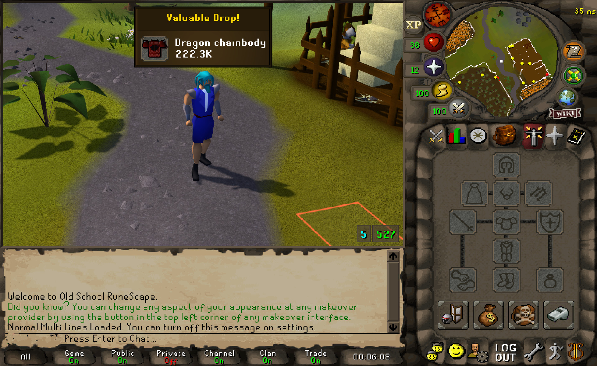
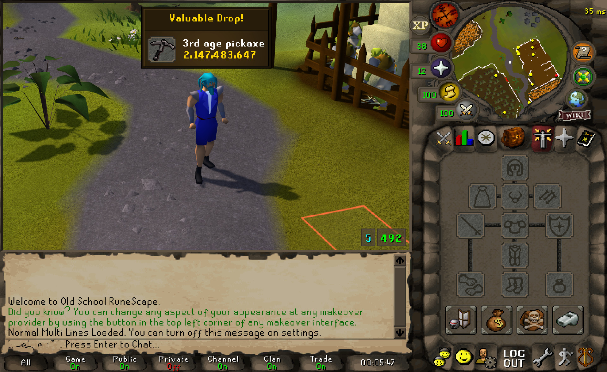
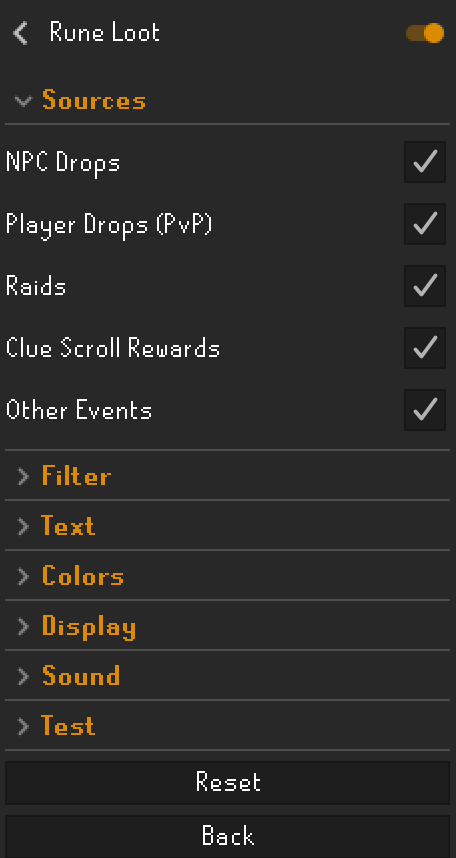
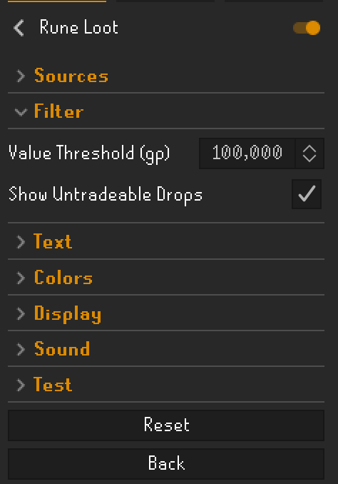
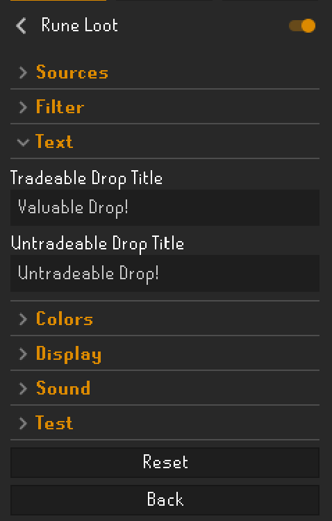
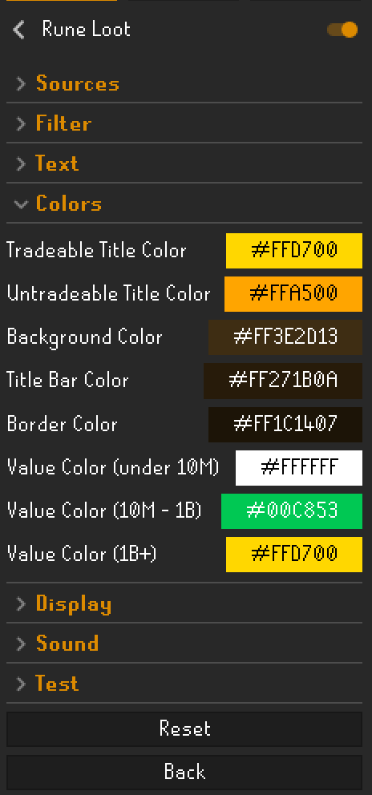
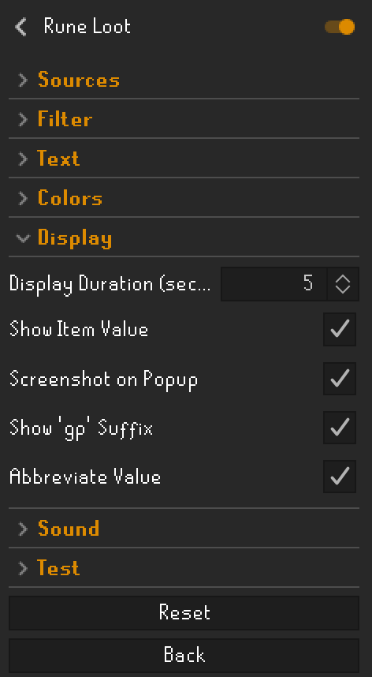
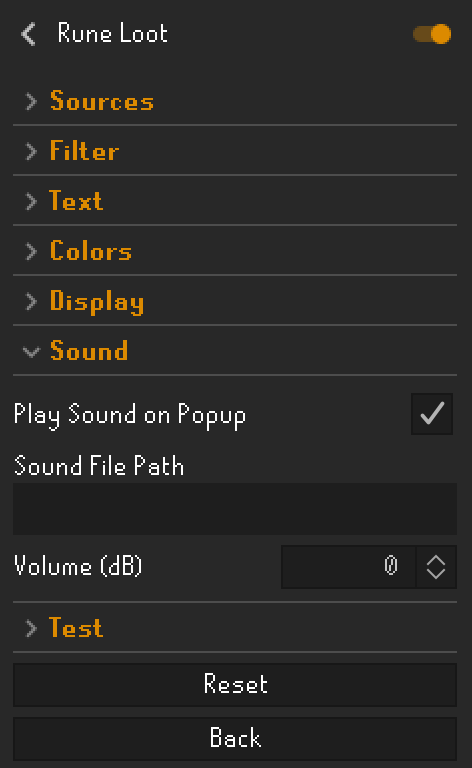
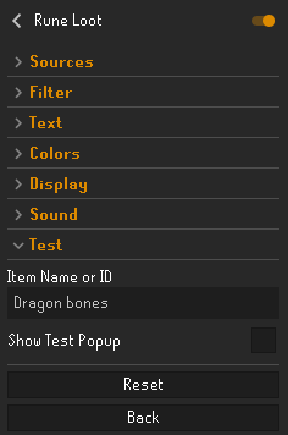

# Rune Loot

Rune Loot brings Collection Log-style notifications to valuable drops. Set a GP threshold and an animated popup shows up at the top of your screen with the item icon, name, and value whenever something worth picking up drops.

  
  

## Installation

Install via the RuneLite Plugin Hub. Search for **Rune Loot**, click Install, then enable it with the toggle in the plugin list.

Rune Loot requires the **Loot Tracker** plugin to be enabled. It will be enabled automatically when you turn on Rune Loot.

## Settings

Click the wrench icon next to Rune Loot in the plugin list to open settings.

### Sources

Pick which loot events trigger the popup.

| Setting | Description |
|---|---|
| NPC Drops | Drops from monsters and bosses |
| Player Drops (PvP) | Drops from players you kill |
| Raids | Chambers of Xeric, Theatre of Blood, Tombs of Amascut |
| Clue Scroll Rewards | Casket openings |
| Other Events | Barrows, minigames, and other loot sources |

 

### Filter

| Setting | Default | Description |
|---|---|---|
| Value Threshold (gp) | 100,000 | Minimum GP value to trigger a popup |
| Show Untradeable Drops | On | Show untradeable drops regardless of value |
| Excluded Items | (empty) | Comma-separated item names to never show a popup for, e.g. `Bull bones, Serafina's diary, The butcher` |

 

### Text

The title shown at the top of the popup.

| Setting | Default |
|---|---|
| Tradeable Drop Title | Valuable Drop! |
| Untradeable Drop Title | Untradeable Drop! |

 

### Colors

| Setting | Default | Description |
|---|---|---|
| Tradeable Title Color | Gold | Title text color for tradeable drops |
| Untradeable Title Color | Orange | Title text color for untradeable drops |
| Background Color | Dark brown | Main background |
| Title Bar Color | Darker brown | Title bar background |
| Border Color | Near-black brown | Popup border |
| Value Color (under 10M) | White | Value text below 10,000,000 gp |
| Value Color (10M - 1B) | Green | Value text between 10M and 1B gp |
| Value Color (1B+) | Gold | Value text at or above 1,000,000,000 gp |

 

### Display

| Setting | Default | Description |
|---|---|---|
| Display Duration (seconds) | 3 | How long the popup stays before closing |
| Show Item Value | On | Show the GP value below the item name |
| Show Untradeable Value | On | Show the high-alch value for untradeable drops |
| Screenshot on Popup | On | Saves a screenshot when the popup appears, to `.runelite/rune-loot/screenshots/` |
| Show 'gp' Suffix | On | Append "gp" after the value |
| Abbreviate Value | On | Show `222.3K` instead of `222,300` |

 

### Sound

| Setting | Default | Description |
|---|---|---|
| Play Sound on Popup | On | Play a sound when the popup appears |
| Sound File Path | _(blank)_ | Path to a custom WAV file. Leave blank for the built-in sound. MP3 is not supported. |
| Volume (dB) | 0 | Volume adjustment. Negative is quieter, positive is louder. Range: -40 to +6 dB. |

 

### Test

Preview the popup without needing an actual drop.

| Setting | Description |
|---|---|
| Item Name or ID | An item name (e.g. `Dragon bones`) or numeric item ID |
| Show Test Popup | Toggle to fire a test popup. Resets automatically. |

 